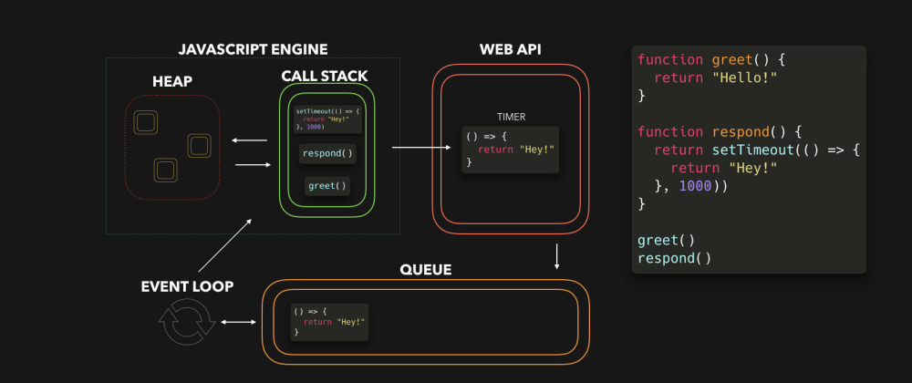

# Chapter 5 - Asynchronous JavaScript

JavaScript is single-threaded: only one task can run at a time. Usually that’s no big deal, but now imagine you’re running a task which takes 30 seconds.

During that task we’re waiting for 30 seconds before anything else can happen (JavaScript runs on the browser’s main thread by default, so the entire UI is stuck)...

## Asynchronous Programming and the Event Loop

Asynchronous programming is a *programming paradigm* that allows multiple tasks to be executed concurrently, without blocking the execution of other tasks. This is particularly important in web development, where tasks such as fetching data from a server, handling user input, and updating the UI need to occur asynchronously to provide a smooth and responsive user experience.

The Event Loop is a fundamental concept in asynchronous programming in JavaScript and is responsible for managing the execution of asynchronous tasks and ensuring that they are processed in the correct order. The Event Loop continuously monitors the call stack and the task queue, moving tasks from the queue to the stack for execution when the stack is empty.

### How Does It Work?



When an asynchronous operation is initiated (such as fetching data from a server or setting a timer), it is offloaded to the browser's internal APIs, and execution continues synchronously.

Once the asynchronous operation completes, a callback function associated with the operation is placed in the task queue.

The Event Loop continuously checks the call stack. If the stack is empty, it takes the first task from the task queue and pushes it onto the call stack for execution.

The callback function is executed, and any additional synchronous code within it is processed.

Once the callback function completes execution, the Event Loop moves on to the next task in the task queue, if any, repeating the process.

This asynchronous nature of JavaScript allows for non-blocking I/O operations, making it well-suited for handling tasks such as fetching data from servers, processing large amounts of data, and updating the UI without freezing the browser.

---

The best example of this I found was at [this site](https://dev.to/lydiahallie/javascript-visualized-event-loop-3dif).


And then explained this code:

```js
const foo = () => console.log("First");
const bar = () => setTimeout(() => console.log("Second"), 500);
const baz = () => console.log("Third");

bar();
foo();
baz();
```


1. We invoke `bar`. `bar` returns a `setTimeout` function.
2. The callback we passed to setTimeout gets added to the Web API, the setTimeout function and `bar` get popped off the callstack.
3. The timer runs, in the meantime `foo` gets invoked and logs **First**. `foo` returns (undefined),`baz` gets invoked, and the callback gets added to the queue.
4. `baz` logs **Third**. The event loop sees the callstack is empty after `baz` returned, after which the callback gets added to the call stack.
5. The callback logs **Second**.

---

## Callback functions and handling asynchronous operations.

Callback functions are used JavaScript for handling asynchronous operations. 

They are functions passed as *arguments* to other functions, which are then called once the asynchronous operation completes or a certain condition is met. Callback functions allow you to execute code after an asynchronous task finishes, ensuring that dependent operations are executed in the correct order.

### How Do You Use Them?

1. First, you pass a callback function as an *argument* to an asynchronous function that performs some operation.
2. Second, *once the asynchronous operation completes* (or a certain condition is met), the callback function is invoked, and any necessary processing or handling of the result can be performed.

Callback functions are commonly used with asynchronous functions like `setTimeout`, `setInterval`, `fetch`, and event listeners in JavaScript.

### Okay, Let's See Some Code

#### Using setTimeout with a Callback Function

```js
// Asynchronous operation (setTimeout)
console.log('Start');

setTimeout(() => {
    console.log('Async operation completed after 2 seconds');
}, 2000);

console.log('End');
```

Here the *anonymous callback function defined by arrow notation* (`() => {...}`) is passed to `setTimeout` is executed after 2 seconds. So the function will print to the console after 2 seconds, which means the output will be:

```
Start
End
Async operation completed after 2 seconds
```

### Defining and Using Custom Callback Functions
```js
// Custom function with a callback
function fetchData(callback) {
    setTimeout(() => {
        const data = { name: 'John', age: 30 };
        callback(data);
    }, 2000);
}

console.log('Start');

// Using the custom function with a callback
fetchData((data) => {
    console.log('Data received:', data);
    console.log('Custom operation completed');
});

console.log('End');
```

Our `fetchData` function accepts a callback function as an argument. After a timeout of 2 seconds, it invokes the callback function with some data.

Yep, it *is* a bit confusing isn't it. Let's break down what in the name of hell is going on here.

I have a function, `fetchData` which has one parameter named `callback` which it expects to be a function. So this is a higher-order function - it's a function that accepts a function as a parameter.

Next I use the `setTimeout` function to set a schedule it to return in the future, but not delay execution in the meantime. Inside the `setTimeout` function, after 2 seconds it will create a new object, and then using the *function it was passed* earlier (`callback`) it executes that function.

But where is this mysterious function named `callback`?

It's actually this line:

```js
fetchData((data) => {
```

This says "call the `fetchdata` function and pass this anonymous function that has one parameter called `data`."

And this anonymous function's action on being invoked or called is to log out what it has been passed in the single parameter.

### I'm Still Baffled

Me too - it's why i don't like anonymous functions much in actual projects.

Here's the code using defined functions, which should make it a lot clearer:

```js
function fetchData(callback) {
    setTimeout(function () {
        const data = { name: 'John', age: 30 };
        callback(data);
    }, 2000);
}

function handleData(data) {
    console.log('Data received:', data);
    console.log('Custom operation completed');
}

console.log('Start');

// Using the custom function with a callback
fetchData(handleData);

console.log('End');
```

To me this is *far* clearer about what is happening and I would encourage you to do this!

Now I can *see* that I call `fetchdata` by providing it a named function, `handledata`. Ican see that `handledata` itself accepts one parameter.

Now all I have to think about is what's going on inside the `setTimeout` function!

---

## Promises: creating, chaining, and error handling

Promises are objects used for asynchronous operations in JavaScript. They represent the eventual completion (or failure) of an asynchronous operation and allow you to handle the result (or error) asynchronously. 

Promises simplify the process of writing asynchronous code by providing a cleaner and more structured way to handle asynchronous operations compared to callbacks - even though we've just been learning about them! I "promise" it will come clear soon!

Promises are used in JavaScript whenever you have asynchronous operations that need to be handled in a structured and organized manner. And here's why : computers read code from top to bottom and don't move on until the line completes.

But we might have long-running operations that we don't want to "freeze" our program or UI. Instead, if we send a function, and make a promise that it *will* be resolved at some unknown point in the future, our code can continue without waiting for it to actually complete.

Anything that might take time, we can hand off with a promise that it will do something in the future. Reading from a database, getting data from an API, image processing, reading from disk, etc.

This is the basis of JS async programming.

### Creating Promises
You can create a promise using the `Promise` constructor. The promise constructor takes a function as an argument (*but we're used to that now, right?*), which in turn takes two parameters: *resolve* and *reject*. 

*Inside* this function, you perform an asynchronous operation, and then call *resolve* with the result if the operation is successful, or *reject* with an error if the operation fails.

```js
const myPromise = new Promise((resolve, reject) => {
    // Perform asynchronous operation
    if (/* operation successful */) {
        resolve('Operation successful');
    } else {
        reject(new Error('Operation failed'));
    }
});
```

### Chaining Promises
You can chain promises together using the `.then()` method. Each `.then()` block receives the result (or error) from the previous promise, allowing you to perform additional operations sequentially.

```js
myPromise
    .then(result => {
        // Handle successful result
        console.log(result);
        return anotherPromise;
    })
    .then(anotherResult => {
        // Handle another successful result
        console.log(anotherResult);
    })
```

### Error Handling 

You can handle errors in promises using the `.catch()` method, which allows you to catch any errors that occur in the promise chain.
```js
myPromise
    .then(result => {
        // Handle successful result
        console.log(result);
    })
    .catch(error => {
        // Handle errors
        console.error(error);
    });
```

### Actual Example

Now, let's put it all together with a complete example. We are going to create a promise that simulates generating a random number after 1 second.

The random number generated will either *resolve* the promise if it's bigger than 0.5, or will *reject* the promise if not with an error.

If the promise resolves it will first double the number and then print it out, and the `catch` block is not executed.

If the promise is rejected it will ignore the `then` blocks and `catch` block will execute and print the error.

```js
// Creating a promise
const myPromise = new Promise((resolve, reject) => {
    // Simulating an asynchronous operation
    setTimeout(() => {
        const randomNumber = Math.random();
        if (randomNumber > 0.5) {
            resolve(randomNumber);
        } else {
            reject(new Error('Random number is too small'));
        }
    }, 1000);
});

// Chaining promises and handling errors
myPromise
    .then(result => {
        console.log('Random number:', result);
        return result * 2;
    })
    .then(doubledNumber => {
        console.log('Doubled number:', doubledNumber);
    })
    .catch(error => {
        console.error('Error:', error);
    });
```

-----

## Working with APIs: making HTTP requests using Fetch API

Working with APIs often involves making [HTTP requests](https://github.com/bjssacademy/fundamentals-http) to retrieve data from a server. In JavaScript, you can use the Fetch API to perform these HTTP requests asynchronously. The Fetch API provides a simple way for fetching resources (such as [JSON](https://github.com/bjssacademy/fundamentals-json) data, HTML files, or images) across the network.

If you are not sure about HTTP or JSON, click the links above to find out more before carrying on!

One of the first things you'll notice about `fetch` is that it is promise-based. You can use exactly the same promise style `.then` and `.catch`.

### Fetch Availability

Fetch is natively supported in the browser, but not on the server side.
This means you *can* use fetch on your client side code (the UI), but you *cannot* use it on the server side.

However, good news is that some bright spark has added an NPM package we can install.

`npm install node-fetch`

And then at the top of your .js file, you add 

```js
const fetch = require('node-fetch');
```

Now you should be able to use the examples below in your Node environment.

### Making a GET Request

Firstly, the `fetch` promise takes a least one parameter, the URL, you want to get (or *fetch*) data from. Since this is a promise, if it resolves then you get another promise back, the `response` object.

The `response` object does not contain the actual JSOn data you want - it's actually the entire HTTP response! So we need to use the `.json` method on the `response` object to get the JSON body back.

Let's see the code:

```js
fetch('https://jsonplaceholder.typicode.com/todos/1')
    .then(response => {
        // Handle successful response
        if (response.ok) {
            return response.json(); // Parse response body as JSON
        } else {
            throw new Error('Network response was not ok.');
        }
    })
    .then(data => {
        // Process the JSON data
        console.log(data);
    })
    .catch(error => {
        // Handle errors
        console.error('Fetch error:', error);
    });
```

> We're using a free endpoint here at https://jsonplaceholder.typicode.com/

Okay, so that's pretty cool. There are also other endpoints we can use to practice using POST, Put and DELETE.

### Using a Callback Function with fetch for HTTP Requests


So now we're actually put together callbacks and promises. What a time to be alive.

```js
// Asynchronous operation (fetch)
console.log('Start');

fetch('https://jsonplaceholder.typicode.com/posts/1')
    .then(response => response.json())
    .then(data => {
        console.log(data);
        console.log('Fetch operation completed');
    })
    .catch(error => console.error('Error:', error));

console.log('End');
```

`.then()` and `.catch()` methods are used to handle the result of the asynchronous fetch operation. These methods take callback functions as arguments, making it a classic example of using callback functions with asynchronous operations.

```js
.then(response => response.json())
```

In this line, the arrow function `response => response.json()` is passed as a callback function to the `.then()` method. This callback function is executed when the promise returned by `fetch()` resolves successfully. It takes the HTTP response object returned by fetch as input and calls the `.json()` method on it to parse the response body as JSON. The result of this parsing operation is then passed to the next `.then()` method in the chain.

```js
.then(data => {
    console.log(data);
    console.log('Fetch operation completed');
})
```
This arrow function is *another* callback function passed to the `.then()` method. It receives the parsed JSON data as input and logs it to the console. 

```js
.catch(error => console.error('Error:', error));
```

The `.catch()` method is used to handle errors that occur during the execution of the promise chain and it takes a callback function as an argument, which is executed if any of the preceding promises in the chain reject.

### More Fetch

I'm not going to duplicate a lot of the work other people have done better than me, so the [official site for fetch](https://developer.mozilla.org/en-US/docs/Web/API/Fetch_API) has *way* more information and examples and I'd only be repeating their words!

---

## Introduction to async/await

Async/await is a modern JavaScript syntax for working with asynchronous code in a more synchronous and readable way. It allows you to write asynchronous code that looks and behaves more like synchronous code, making it easier to understand and maintain.

> I actually prefer this way of working rather than using `.then` as it's easier to debug when things go wrong! 

An async function is a function that operates asynchronously and *always* returns a promise, and you can make any function async by adding the `async` keyword:

```js
async function myAsyncFunction() {
    // Asynchronous code here
}
```

And you call it exactly like you would any other function.

The benefit of having an async function like this is that you can make the code inside it act more synchronous - that is, wait for the line to complete and resolve its promise before executing the next line.

### Await

The `await` keyword is used inside async functions to pause the execution of the function until a promise is resolved. It can only be used inside async functions. When you use `await` before a promise, the execution of the async function is paused until the promise is resolved, and the result of the promise is returned.

```js
async function fetchData() {
    const response = await fetch('https://jsonplaceholder.typicode.com/posts/1');
    const data = await response.json();
    console.log(data);
}
```

Whilst this function is now async, the code within it is synchronous, and easier to debug. The use of the `await` keyword allows us to wait for the data to be returned and stored in the response variable.

We can then get the json response out from the response object.

> I find this *far* simpler than chaining `then` methods...

Async/await can be used with *any* function that returns a promise. You can await the result of a promise inside an async function just like you would with any other asynchronous operation.

### Errors

We can handle errors using a standard try/catch block:

```js
async function fetchData() {
    try {
        const response = await fetch('https://api.example.com/data');
        const data = await response.json();
        console.log(data);
    } catch (error) {
        console.error('Error:', error);
    }
}
```

### Example

```js
async function fetchData() {
    try {
        const response = await fetch('https://jsonplaceholder.typicode.com/posts/1');
        if (!response.ok) {
            throw new Error('HTTP error ' + response.status);
        }
        const data = await response.json();
        console.log(data);
    } catch (error) {
        console.error('Error:', error);
    }
}

console.log('Start');
fetchData();
console.log('End');

```
---

[Chapter 6 - Destructuring, Spread/Rest Operators >>](chapter6.md)